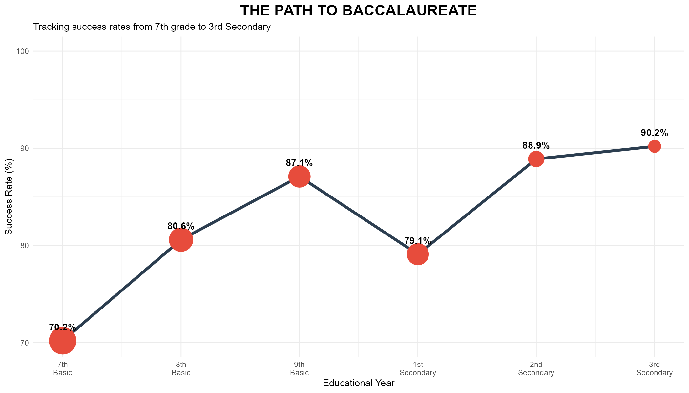

<p align="center">
  
</p>

<h1 align="center">🎓 تحليل نسب النجاح في الباكالوريا التونسية 2025</h1>
<h2 align="center">Tunisia Baccalaureate Success Rate Analysis</h2>

<p align="center">
  <a href="https://chaima-massaoudi.github.io/R_project/">
    
  </a>
  <a href="https://github.com/chaima-massaoudi/R_project">
    
  </a>
  <a href="presentation.pptx">
    
  </a>
</p>

---

## 📋 Table des Matières | جدول المحتويات

- [À propos du projet](#-à-propos-du-projet)
- [Démonstration](#-démonstration)
- [Données](#-données)
- [Résultats clés](#-résultats-clés)
- [Technologies](#️-technologies)
- [Structure du projet](#-structure-du-projet)
- [Installation](#-installation)
- [Auteur](#-auteur)

---

## 🎯 À propos du projet

<table>
<tr>
<td width="50%">

### 🇫🇷 Français
Ce projet analyse les **taux de réussite au Baccalauréat tunisien 2025** à travers :
- **7 filières académiques** (Sciences, Maths, Économie, Lettres, Informatique, Sport, Arts)
- **26 délégations régionales**
- Analyse comparative et statistique approfondie

**Objectifs :**
- Visualiser les disparités régionales
- Comparer les performances par filière
- Identifier les facteurs de réussite

</td>
<td width="50%">

### 🇹🇳 العربية
يحلل هذا المشروع **نسب النجاح في الباكالوريا التونسية 2025** من خلال:
- **7 شعب دراسية** (علوم، رياضيات، اقتصاد، آداب، إعلامية، رياضة، فنون)
- **26 مندوبية جهوية**
- تحليل مقارن وإحصائي معمق

**الأهداف:**
- تصوير الفوارق الجهوية
- مقارنة الأداء حسب الشعب
- تحديد عوامل النجاح

</td>
</tr>
</table>

---

## 🌐 Démonstration

| Ressource | Lien |
|-----------|------|
| 🌍 **Site Web (Arabic RTL)** | [chaima-massaoudi.github.io/R_project](https://chaima-massaoudi.github.io/R_project/) |
| 📊 **Présentation Slides** | [Voir en ligne](https://chaima-massaoudi.github.io/R_project/presentation.html) |
| 📥 **PowerPoint (PPTX)** | [Télécharger](presentation.pptx) |
| 📓 **Jupyter Notebook (R)** | [analysis.ipynb](analysis.ipynb) |

---

## 📊 Données

### Source
**Ministère de l'Éducation Tunisien - وزارة التربية التونسية**

### Description

| Élément | Détails |
|---------|---------|
| 📅 **Année** | Baccalauréat 2025 |
| 🎓 **Filières** | 7 (Maths, Sciences, Économie, Lettres, Informatique, Sport, Arts) |
| 🗺️ **Régions** | 26 délégations régionales |
| 📈 **Variables** | Candidats inscrits, admis, taux de réussite |

---

## 📈 Résultats Clés

### Taux de réussite par filière | نسب النجاح حسب الشعبة

```
🎨 فنون التشكيل (Arts)           ████████████████████ 80.00%
🔢 الرياضيات (Maths)             ██████████████░░░░░░ 74.93%
🏃 الرياضة (Sports)              █████████████░░░░░░░ 73.33%
💻 علوم الإعلامية (IT)           ██████████░░░░░░░░░░ 48.47%
🔬 العلوم التجريبية (Sciences)   █████████░░░░░░░░░░░ 45.83%
⚙️ العلوم التقنية (Tech)         ███████░░░░░░░░░░░░░ 35.02%
💼 الاقتصاد (Economics)          ██████░░░░░░░░░░░░░░ 28.95%
📚 الآداب (Literature)           █████░░░░░░░░░░░░░░░ 23.02%
```

### Statistiques nationales | الإحصائيات الوطنية

<table align="center">
<tr>
<th>📊 Indicateur</th>
<th>📈 Valeur</th>
</tr>
<tr>
<td><b>Moyenne nationale</b></td>
<td><b>53.05%</b></td>
</tr>
<tr>
<td>Meilleure région</td>
<td>Sfax 1 (71.31%)</td>
</tr>
<tr>
<td>Écart-type régional</td>
<td>8.42</td>
</tr>
</table>

---

## 🛠️ Technologies

<p align="center">
  
  
  
  
  
</p>

| Outil | Usage |
|-------|-------|
| **R** | Analyse statistique et calculs |
| **Quarto** | Publication scientifique et site web |
| **ggplot2** | Visualisations et graphiques |
| **dplyr** | Manipulation des données |
| **readxl** | Lecture des fichiers Excel |
| **kableExtra** | Tableaux formatés |
| **RevealJS** | Présentation interactive |

---

## 📁 Structure du Projet

```
R_project/
│
├── 📄 _quarto.yml           # Configuration Quarto (Arabic RTL)
├── 📄 index.qmd             # Page d'accueil
├── 📄 bac_story.qmd         # Analyse narrative
├── 📄 bac_analysis.qmd      # Analyse complète
├── 📄 data_exploration.qmd  # Exploration des données
├── 📄 visualizations.qmd    # Visualisations
├── 📄 statistics.qmd        # Tests statistiques
│
├── 📓 analysis.ipynb        # Jupyter Notebook (R kernel)
├── 📊 presentation.qmd      # Slides RevealJS
├── 📊 presentation.pptx     # PowerPoint
│
├── 📂 R/
│   └── run_analysis.R       # Script R principal
│
├── 📂 data/
│   ├── liste_reussite_eleves.xls  # Données sources
│   └── results/                    # Résultats pré-calculés (.rds)
│
├── 📂 img/                  # Graphiques générés
├── 📄 styles.css            # Styles CSS (RTL Arabic)
└── 📄 README.md             # Ce fichier
```

---

## 🚀 Installation

### Prérequis

- **R** (≥ 4.0)
- **Quarto** (≥ 1.3)
- **RStudio** (recommandé)

### Étapes

```bash
# 1. Cloner le dépôt
git clone https://github.com/chaima-massaoudi/R_project.git
cd R_project

# 2. Installer les packages R
Rscript -e "install.packages(c('tidyverse', 'readxl', 'knitr', 'kableExtra', 'DT', 'scales'))"

# 3. Exécuter l'analyse
Rscript R/run_analysis.R

# 4. Générer le site web
quarto render

# 5. Prévisualiser localement
quarto preview
```

---

## 📸 Aperçu des Visualisations

| Graphique | Description |
|-----------|-------------|
| 📊 Distribution par filière | Comparaison des taux de réussite |
| 🗺️ Analyse régionale | Top 10 des délégations |
| 📉 Analyse des écarts | Gap par rapport à la moyenne nationale |
| 📈 Tendances | Évolution et corrélations |

---

## 👩‍💻 Auteur

<p align="center">
  <b>Chaima Massaoudi</b><br>
  <a href="https://github.com/chaima-massaoudi">
    
  </a>
</p>

---

## 📄 Licence

Ce projet est open source et disponible sous la licence MIT.

---

<p align="center">
  <b>🇹🇳 Projet d'analyse des données éducatives en Tunisie</b><br>
  <i>مشروع تحليل البيانات التعليمية في تونس</i>
</p>

<p align="center">
  Made with ❤️ using R and Quarto
</p>
